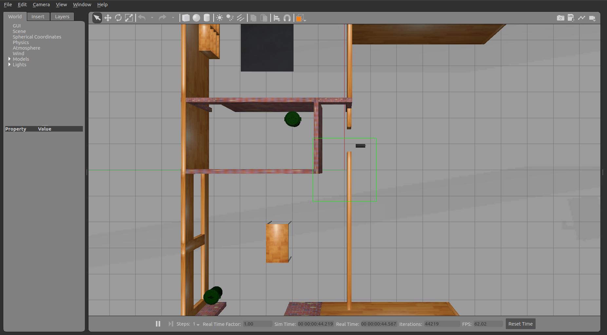
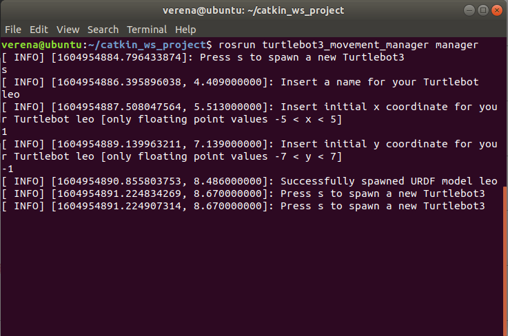
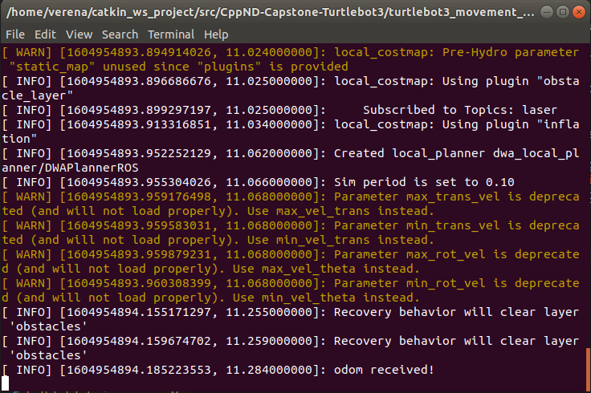
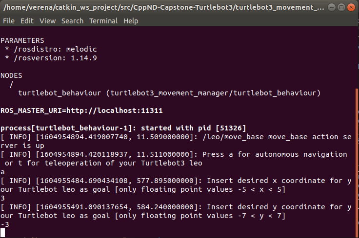
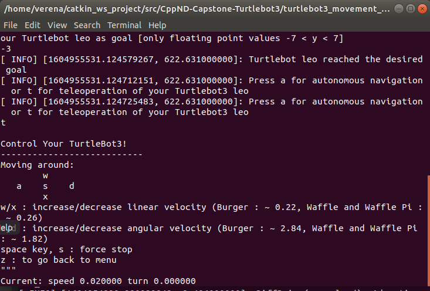

# CppND-Capstone-Turtlebot3: Project of choice
This project builds upon the [Turtlebot3](https://emanual.robotis.com/docs/en/platform/turtlebot3/overview/) ROS packages and allows you to generically spawn new Turtlebot instances to a Gazebo simulation environment and to manage their movement either by setting a desired goal position using the autonomous navigation mode or by using the keyboard to control the robot using the teleoperation mode. 

This is accomplished by a set of existing nodes, in particular these include the nodes of the ROS navigation stack wrapped by custom launch files and appropriate namespacing, combined with two custom nodes [`manager.cpp`](https://github.com/verena-roehrl/CppND-Capstone-Turtlebot3/blob/main/turtlebot3_movement_manager/src/manager.cpp) and [`turtlebot_behaviour.cpp`](https://github.com/verena-roehrl/CppND-Capstone-Turtlebot3/blob/main/turtlebot3_movement_manager/src/turtlebot_behaviour.cpp). The latter is wrapped by a corresponding launch file and appropriate namespace as well.

The main functionality is given by two cpp files:
* [`manager.cpp`](https://github.com/verena-roehrl/CppND-Capstone-Turtlebot3/blob/main/turtlebot3_movement_manager/src/manager.cpp): Manager class responsible for processing the user input to spawn new instances of the Turtlebot class. The Turtlebot class is responsible for reading the URDF from file, spawning the URDF to Gazebo and for launching the `turtlebot_behaviour` node as well as its dependencies.
* [`turtlebot_behaviour.cpp`](https://github.com/verena-roehrl/CppND-Capstone-Turtlebot3/blob/main/turtlebot3_movement_manager/src/turtlebot_behaviour.cpp): Turtlebot Behaviour class responsible for processing the user input to select and execute autonomous navigation or teleoperation mode. 

## Addressed rubric points
* **The project demonstrates an understanding of C++ functions and control structures:** various functions and control structures are used throughout the above two `.cpp` files
* **The project reads data from a file and process the data, or the program writes data to a file:** `manager.cpp` reads the robot description from file in line 40
* **The project accepts user input and processes the input:** `manager.cpp` and `turtlebot_behaviour.cpp` process user input in line 112 (`manager.cpp`) and line 278 (`turtlebot_behaviour.cpp`)
* **Object Oriented Programming:** both `manager.cpp` and `turtlebot_behaviour.cpp` are structured as OOP code and therefore use a variety of corresponding features.

## Installation instructions


**Prerequisites:**
* Ubuntu 18.04

### Install ROS Melodic
http://wiki.ros.org/melodic/Installation/Ubuntu

### Install additional dependencies
```
$ sudo apt install ros-melodic-map-server
$ sudo apt install ros-melodic-amcl
$ sudo apt install ros-melodic-move-base
$ sudo apt install ros-melodic-dwa-local-planner
```

### Create Catkin workspace
```
$ mkdir -p ~/catkin_ws/src
$ cd catkin_ws
$ catkin_make

```
### Set environment variables and source workspace
```
$ echo "source ~/catkin_ws/devel/setup.bash" >> ~/.bashrc
$ echo "export TURTLEBOT3_MODEL=waffle" >> ~/.bashrc
$ source ~/.bashrc

```
If you want to run the Gazebo simulation on a VMware virtual machine, the following variable needs to be set as well:
```
$ echo "export SVGA_VGPU10=0" >> ~/.bashrc
```

### Clone this Repo
```
$ cd src
$ git clone https://github.com/verena-roehrl/CppND-Capstone-Turtlebot3.git
```
### Update submodules
```
$ cd CppND-Capstone-Turtlebot3
$ git submodule init
$ git submodule update
$ cd turtlebot3
$ git checkout master
$ git pull
$ cd ..
$ cd turtlebot3_msgs
$ git checkout master
$ git pull
$ cd ..
$ cd turtlebot_simulations
$ git checkout master
$ git pull
```
### Build workspace
```
$ cd ~/catkin_ws/
$ catkin_make
```

## Usage instructions

### Launch the Gazebo environment
In a new terminal execute the command:
```
$ roslaunch turtlebot3_gazebo_custom multi_turtlebot3_empty.launch 
```
This launches the Gazebo environment and you should see the following:

### Launch the custom manager node
In a new terminal execute the command:
```
$ rosrun turtlebot3_movement_manager manager
```
This is the starting point for spawning and moving new Turtlebots.
The terminal output guides you through the procedure by requesting some necessary data.
The following picture provides a possible example of user input:

This command has multiple effects:
* It spawns a new Turtlebot model "leo" to the Gazebo environment:

* It opens a new terminal and inside it launches the dependencies of the robot's navigation capabilities packed into the launch file [`multi_turtlebot3_navigation_namespace.launch`](https://github.com/verena-roehrl/CppND-Capstone-Turtlebot3/blob/main/turtlebot3_navigation_custom/launch/multi_turtlebot3_navigation_namespace.launch)

This terminal only helped for debugging and can safely be ignored.
* It opens a new terminal and inside it launches the custom ROS node [`turtlebot_behaviour.cpp`](https://github.com/verena-roehrl/CppND-Capstone-Turtlebot3/blob/main/turtlebot3_movement_manager/src/turtlebot_behaviour.cpp)
This terminal guides the user through the process of moving the newly spawned Turtlebot.
The following picture provides a possible example of user input:

In Gazebo you will see the robot autonomously moving to the specified goal.
After reaching the goal, the user can again decide to either specify another goal to be reached autonomously or to use the teleoperation mode.
The following picture provides a possible example of user input:

Now you can control the Turtlebot using the keys `a`, `d`, `w`, `x`. Pressing the key `s` stops the robot and by hitting `z` you can get back to the menu to select either the autonomous navigation or the teleoperation mode.

You can also spawn multiple Turtlebots by going back to the `Manager` terminal and following the procedure again to create and control a new Turtlebot (with a different name, as names have to be unique for a proper access).